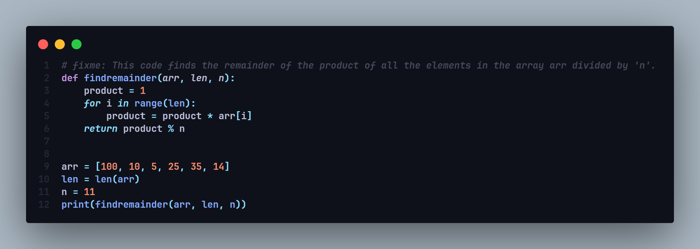

<link rel="stylesheet" href="./assets/css/style.css">

# Hi, I'm Spartan (💻💖)


# 😅 My VSCode Setup

This is a setup that I worked hard on trying to find the one that I liked the most

## How to install

<p align="left">
  <a href="https://github.com/xSpartan155x/VSCode/tree/main/docs"></a>
</p>

## 📄 Font Used

- [JetBrains Mono](https://www.jetbrains.com/lp/mono/)
  


## 📥 Extensions List

- [Angular schematics](https://marketplace.visualstudio.com/items?itemName=cyrilletuzi.angular-schematics)
- [Angular2](https://marketplace.visualstudio.com/items?itemName=johnpapa.angular2)
- [Auto rename tag](https://marketplace.visualstudio.com/items?itemName=formulahendry.auto-rename-tag)
- [Azure repos](https://marketplace.visualstudio.com/items?itemName=ms-vscode.azure-repos)
- [Better comments](https://marketplace.visualstudio.com/items?itemName=aaron-bond.better-comments)
- [Blackbox](https://marketplace.visualstudio.com/items?itemName=blackboxapp.blackbox)
- [Blackboxagent](https://marketplace.visualstudio.com/items?itemName=blackboxapp.blackboxagent)
- [Bootstrap5 vscode](https://marketplace.visualstudio.com/items?itemName=anbuselvanrocky.bootstrap5-vscode)
- [Code runner](https://marketplace.visualstudio.com/items?itemName=formulahendry.code-runner)
- [Codesnap](https://marketplace.visualstudio.com/items?itemName=adpyke.codesnap)
- [Composer php vscode](https://marketplace.visualstudio.com/items?itemName=devsense.composer-php-vscode)
- [Debugpy](https://marketplace.visualstudio.com/items?itemName=ms-python.debugpy)
- [Discord py snippets](https://marketplace.visualstudio.com/items?itemName=wasimaster.discord-py-snippets)
- [Errorlens](https://marketplace.visualstudio.com/items?itemName=usernamehw.errorlens)
- [Fluent icons](https://marketplace.visualstudio.com/items?itemName=miguelsolorio.fluent-icons)
- [Git graph](https://marketplace.visualstudio.com/items?itemName=mhutchie.git-graph)
- [Github vscode theme](https://marketplace.visualstudio.com/items?itemName=github.github-vscode-theme)
- [Gitlens](https://marketplace.visualstudio.com/items?itemName=eamodio.gitlens)
- [Intelli php vscode](https://marketplace.visualstudio.com/items?itemName=devsense.intelli-php-vscode)
- [Javascriptsnippets](https://marketplace.visualstudio.com/items?itemName=xabikos.javascriptsnippets)
- [Jquery snippets](https://marketplace.visualstudio.com/items?itemName=hridoy.jquery-snippets)
- [Jquerysnippets](https://marketplace.visualstudio.com/items?itemName=donjayamanne.jquerysnippets)
- [Liveserver](https://marketplace.visualstudio.com/items?itemName=ritwickdey.liveserver)
- [Markdown preview enhanced](https://marketplace.visualstudio.com/items?itemName=shd101wyy.markdown-preview-enhanced)
- [Ng template](https://marketplace.visualstudio.com/items?itemName=angular.ng-template)
- [Path intellisense](https://marketplace.visualstudio.com/items?itemName=christian-kohler.path-intellisense)
- [Phptools vscode](https://marketplace.visualstudio.com/items?itemName=devsense.phptools-vscode)
- [Prettier vscode](https://marketplace.visualstudio.com/items?itemName=esbenp.prettier-vscode)
- [Profiler php vscode](https://marketplace.visualstudio.com/items?itemName=devsense.profiler-php-vscode)
- [Python](https://marketplace.visualstudio.com/items?itemName=ms-python.python)
- [Remote explorer](https://marketplace.visualstudio.com/items?itemName=ms-vscode.remote-explorer)
- [Remote repositories](https://marketplace.visualstudio.com/items?itemName=ms-vscode.remote-repositories)
- [Remote ssh edit](https://marketplace.visualstudio.com/items?itemName=ms-vscode-remote.remote-ssh-edit)
- [Remote ssh](https://marketplace.visualstudio.com/items?itemName=ms-vscode-remote.remote-ssh)
- [Remote wsl](https://marketplace.visualstudio.com/items?itemName=ms-vscode-remote.remote-wsl)
- [Remotehub](https://marketplace.visualstudio.com/items?itemName=github.remotehub)
- [Robotcode](https://marketplace.visualstudio.com/items?itemName=d-biehl.robotcode)
- [Robotframework lsp](https://marketplace.visualstudio.com/items?itemName=robocorp.robotframework-lsp)
- [Svg viewer](https://marketplace.visualstudio.com/items?itemName=dheovani.svg-viewer)
- [Twig](https://marketplace.visualstudio.com/items?itemName=whatwedo.twig)
- [Vscode clock](https://marketplace.visualstudio.com/items?itemName=compulim.vscode-clock)
- [Vscode css peek](https://marketplace.visualstudio.com/items?itemName=pranaygp.vscode-css-peek)
- [Vscode custom css](https://marketplace.visualstudio.com/items?itemName=be5invis.vscode-custom-css)
- [Vscode eslint](https://marketplace.visualstudio.com/items?itemName=dbaeumer.vscode-eslint)
- [Vscode jetbrains icon theme](https://marketplace.visualstudio.com/items?itemName=chadalen.vscode-jetbrains-icon-theme)
- [Vscode mjml](https://marketplace.visualstudio.com/items?itemName=attilabuti.vscode-mjml)
- [Vscode pets](https://marketplace.visualstudio.com/items?itemName=tonybaloney.vscode-pets)
- [Vscode pylance](https://marketplace.visualstudio.com/items?itemName=ms-python.vscode-pylance)
- [Vscode status bar title](https://marketplace.visualstudio.com/items?itemName=ksoichiro.vscode-status-bar-title)
- [Vscode tailwindcss](https://marketplace.visualstudio.com/items?itemName=bradlc.vscode-tailwindcss)
- [Vsliveshare](https://marketplace.visualstudio.com/items?itemName=ms-vsliveshare.vsliveshare)
- [Wordpress toolbox](https://marketplace.visualstudio.com/items?itemName=wordpresstoolbox.wordpress-toolbox)
  
## 🔧 Settings JSON

  ```sh
{
    /** ------------ Workbench Settings ------------ **/
    "workbench.colorCustomizations": {
        "inlineparameters.annotationBackground": "#282A3600",
        "inlineparameters.annotationForeground": "#7b82af",
        "scrollbar.shadow": "#24292e00"
    },
    "workbench.editorLargeFileConfirmation": 10024,
    "workbench.layoutControl.enabled": false,
    "workbench.editor.showTabs": "multiple",
    "workbench.tree.indent": 16,
    "workbench.startupEditor": "none",
    "workbench.editor.empty.hint": "hidden",
    "workbench.colorTheme": "GitHub Dark Default",
    "workbench.productIconTheme": "fluent-icons",
    "workbench.iconTheme": "vscode-jetbrains-icon-theme-2023-dark",

    /** ------------ Breadcrumbs Configurations ------------ **/
    "breadcrumbs.enabled": true,
    "breadcrumbs.symbolPath": "on",
    "breadcrumbs.filePath": "on",

    /** ------------ Editor Settings ------------ **/
    "editor.cursorBlinking": "smooth",
    "editor.fontFamily": "JetBrains Mono",
    "editor.fontSize": 16,
    "editor.fontWeight": "bold",
    "editor.fontLigatures": true,
    "editor.smoothScrolling": true,
    "editor.mouseWheelZoom": true,
    "editor.defaultFormatter": "esbenp.prettier-vscode",
    "editor.guides.bracketPairs": "active",
    "editor.lineHeight": 26,
    "editor.lineNumbers": "on",
    "editor.folding": true,
    "editor.glyphMargin": true,
    "editor.guides.indentation": false,
    "editor.scrollbar.horizontal": "hidden",
    "editor.unicodeHighlight.ambiguousCharacters": false,
    "editor.unicodeHighlight.invisibleCharacters": false,
    "editor.minimap.enabled": false,
    "editor.wordWrap": "off",
    "editor.stickyScroll.enabled": false,
    "editor.cursorStyle": "line",
    "editor.cursorSmoothCaretAnimation": "on",
    
    /** ------------ Terminal Configurations ------------ **/
    "terminal.integrated.defaultProfile.osx": "zsh",
    "terminal.integrated.fontFamily": "JetBrains Mono",
    "terminal.integrated.fontSize": 14,
    "terminal.integrated.enableMultiLinePasteWarning": "always",
    "terminal.integrated.cursorStyle": "line",
    "terminal.integrated.cursorBlinking": true,
    "terminal.integrated.defaultProfile.windows": "Git Bash",

    /** ------------ Additional Configurations ------------ **/
    "vscode_custom_css.imports": [
        "file:///${env:APPDATA}/Code/User/vscode-custom/style.css",
        "file:///${env:APPDATA}/Code/User/vscode-custom/script.js"
    ],
    "security.workspace.trust.untrustedFiles": "open",
    "explorer.confirmDelete": false,
    "liveServer.settings.donotShowInfoMsg": true,
    "git.enableSmartCommit": true,
    "git.confirmSync": false,
    "notebook.defaultFormatter": "esbenp.prettier-vscode",
    "remote.SSH.remotePlatform": {
        "spartan-craft.sytes.net": "linux"
    },
    "liveServer.settings.ignoreFiles": [
        ".vscode/**",
        "**/*.scss",
        "**/*.sass",
        "**/*.ts"
    ],
    "python.createEnvironment.trigger": "off",
    "settingsSync.ignoredExtensions": [],

    /** ------------ Prettier ------------ **/
    "prettier.tabWidth": 4,
    "prettier.printWidth": 300,

    /** ------------ Better Comments ------------ **/
    "better-comments.tags": [
        {
            "tag": "TODO",
            "color": "#EA580C",
            "strikethrough": false,
            "backgroundColor": "transparent"
        },
        {
            "tag": "FIXME",
            "color": "#FF2D00",
            "strikethrough": false,
            "backgroundColor": "transparent"
        },
        {
            "tag": "BUG:",
            "color": "#9333EA",
            "strikethrough": false,
            "backgroundColor": "transparent"
        },
        {
            "tag": "HACK",
            "color": "#C026D3",
            "strikethrough": false,
            "backgroundColor": "transparent"
        },
        {
            "tag": "NOTE",
            "color": "#2563EB",
            "strikethrough": false,
            "backgroundColor": "transparent"
        },
        {
            "tag": "INFO",
            "color": "#0EA5E9",
            "strikethrough": false,
            "backgroundColor": "transparent"
        },
        {
            "tag": "IDEA",
            "color": "#FFF",
            "strikethrough": false,
            "backgroundColor": "#EAB308"
        }
    ]
}

```

<br>

💻💖 by [xSpartan155x](https://github.com/xSpartan155x)
