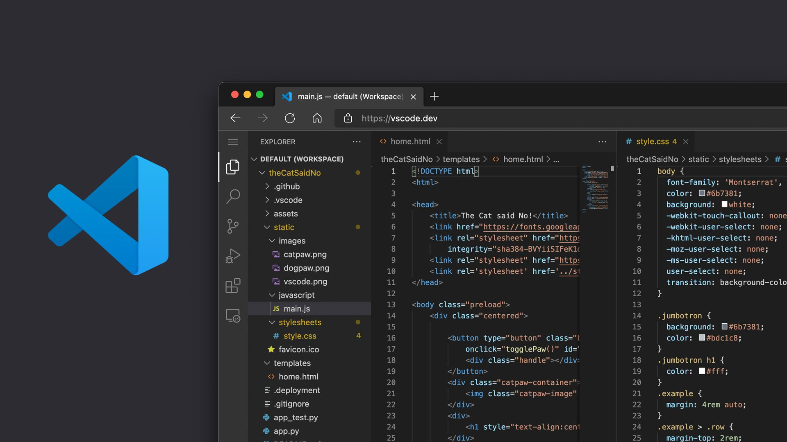
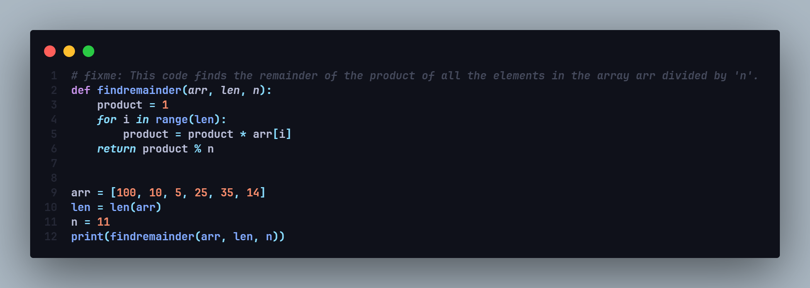

<link rel="stylesheet" href="./assets/css/style.css">

# Hi, I'm Spartan (💻💖)




# 😅 My VSCode Setup

This is a setup that I worked hard on trying to find the one that I liked the most

## How to install

<p align="left">
  <a href="https://github.com/xSpartan155x/VSCode/tree/main/docs"></a>
</p>

## 📄 Font Used

- [JetBrains Mono](https://www.jetbrains.com/lp/mono/)
  


## 📥 Extensions List
| Estensioni |  |  |
|----------|----------|----------|
| [Angular schematics](https://marketplace.visualstudio.com/items?itemName=cyrilletuzi.angular-schematics) | [Angular2](https://marketplace.visualstudio.com/items?itemName=johnpapa.angular2) | [Auto rename tag](https://marketplace.visualstudio.com/items?itemName=formulahendry.auto-rename-tag) |
| [Azure repos](https://marketplace.visualstudio.com/items?itemName=ms-vscode.azure-repos) | [Better comments](https://marketplace.visualstudio.com/items?itemName=aaron-bond.better-comments) | [Codesnap](https://marketplace.visualstudio.com/items?itemName=adpyke.codesnap) |
| [Bootstrap5 vscode](https://marketplace.visualstudio.com/items?itemName=anbuselvanrocky.bootstrap5-vscode) | [Vscode mjml](https://marketplace.visualstudio.com/items?itemName=attilabuti.vscode-mjml) | [Vscode custom css](https://marketplace.visualstudio.com/items?itemName=be5invis.vscode-custom-css) |
| [Vscode animations](https://marketplace.visualstudio.com/items?itemName=brandonkirbyson.vscode-animations) | [Vscode jetbrains icon theme](https://marketplace.visualstudio.com/items?itemName=chadalen.vscode-jetbrains-icon-theme) | [Path intellisense](https://marketplace.visualstudio.com/items?itemName=christian-kohler.path-intellisense) |
| [Vscode clock](https://marketplace.visualstudio.com/items?itemName=compulim.vscode-clock) | [Vscode eslint](https://marketplace.visualstudio.com/items?itemName=dbaeumer.vscode-eslint) | [Composer php vscode](https://marketplace.visualstudio.com/items?itemName=devsense.composer-php-vscode) |
| [Debugpy](https://marketplace.visualstudio.com/items?itemName=ms-python.debugpy) | [Discord py snippets](https://marketplace.visualstudio.com/items?itemName=wasimaster.discord-py-snippets) | [Errorlens](https://marketplace.visualstudio.com/items?itemName=usernamehw.errorlens) |
| [Fluent icons](https://marketplace.visualstudio.com/items?itemName=miguelsolorio.fluent-icons) | [Git graph](https://marketplace.visualstudio.com/items?itemName=mhutchie.git-graph) | [Github vscode theme](https://marketplace.visualstudio.com/items?itemName=github.github-vscode-theme) |
| [Gitlens](https://marketplace.visualstudio.com/items?itemName=eamodio.gitlens) | [Intelli php vscode](https://marketplace.visualstudio.com/items?itemName=devsense.intelli-php-vscode) | [Javascriptsnippets](https://marketplace.visualstudio.com/items?itemName=xabikos.javascriptsnippets) |
| [Jquery snippets](https://marketplace.visualstudio.com/items?itemName=hridoy.jquery-snippets) | [Jquerysnippets](https://marketplace.visualstudio.com/items?itemName=donjayamanne.jquerysnippets) | [Liveserver](https://marketplace.visualstudio.com/items?itemName=ritwickdey.liveserver) |
| [Markdown preview enhanced](https://marketplace.visualstudio.com/items?itemName=shd101wyy.markdown-preview-enhanced) | [Ng template](https://marketplace.visualstudio.com/items?itemName=angular.ng-template) | [Phptools vscode](https://marketplace.visualstudio.com/items?itemName=devsense.phptools-vscode) |
| [Profiler php vscode](https://marketplace.visualstudio.com/items?itemName=devsense.profiler-php-vscode) | [Svg viewer](https://marketplace.visualstudio.com/items?itemName=dheovani.svg-viewer) | [Prettier vscode](https://marketplace.visualstudio.com/items?itemName=esbenp.prettier-vscode) |
| [Code runner](https://marketplace.visualstudio.com/items?itemName=formulahendry.code-runner) | [Copilot](https://marketplace.visualstudio.com/items?itemName=github.copilot) | [Copilot chat](https://marketplace.visualstudio.com/items?itemName=github.copilot-chat) |
| [Remotehub](https://marketplace.visualstudio.com/items?itemName=github.remotehub) | [Vscode status bar title](https://marketplace.visualstudio.com/items?itemName=ksoichiro.vscode-status-bar-title) | [Readme preview](https://marketplace.visualstudio.com/items?itemName=manishsencha.readme-preview) |
| [Python](https://marketplace.visualstudio.com/items?itemName=ms-python.python) | [Vscode pylance](https://marketplace.visualstudio.com/items?itemName=ms-python.vscode-pylance) | [Remote ssh](https://marketplace.visualstudio.com/items?itemName=ms-vscode-remote.remote-ssh) |
| [Remote ssh edit](https://marketplace.visualstudio.com/items?itemName=ms-vscode-remote.remote-ssh-edit) | [Remote wsl](https://marketplace.visualstudio.com/items?itemName=ms-vscode-remote.remote-wsl) | [Remote explorer](https://marketplace.visualstudio.com/items?itemName=ms-vscode.remote-explorer) |
| [Remote repositories](https://marketplace.visualstudio.com/items?itemName=ms-vscode.remote-repositories) | [Vsliveshare](https://marketplace.visualstudio.com/items?itemName=ms-vsliveshare.vsliveshare) | [Material icon theme](https://marketplace.visualstudio.com/items?itemName=pkief.material-icon-theme) |
| [Vscode css peek](https://marketplace.visualstudio.com/items?itemName=pranaygp.vscode-css-peek) | [Vscode pets](https://marketplace.visualstudio.com/items?itemName=tonybaloney.vscode-pets) | [Wordpress toolbox](https://marketplace.visualstudio.com/items?itemName=wordpresstoolbox.wordpress-toolbox) |
  
## 🔧 Settings JSON

  ```sh
  {
    /** ------------ Workbench Settings ------------ **/
    "workbench.colorCustomizations": {
        "inlineparameters.annotationBackground": "#282A3600",
        "inlineparameters.annotationForeground": "#7b82af",
        "scrollbar.shadow": "#24292e00"
    },
    "workbench.iconTheme": "material-icon-theme",
    "workbench.productIconTheme": "fluent-icons",
    "workbench.editorLargeFileConfirmation": 10024,
    "workbench.layoutControl.enabled": false,
    "workbench.editor.showTabs": "multiple",
    "workbench.tree.indent": 16,
    "workbench.startupEditor": "none",
    "workbench.colorTheme": "GitHub Dark Default",
    "workbench.editor.empty.hint": "hidden",

    /** ------------ Breadcrumbs Configurations ------------ **/
    "breadcrumbs.enabled": true,
    "breadcrumbs.symbolPath": "on",
    "breadcrumbs.filePath": "on",

    /** ------------ Editor Settings 1546 Poliphile/jetbrains mono------------ **/
    "editor.cursorBlinking": "smooth",
    "editor.cursorSmoothCaretAnimation": "on",
    "editor.cursorStyle": "line",   
    "editor.fontFamily": "Jetbrains Mono",
    "editor.fontSize": 16,
    "editor.fontWeight": "bold",
    "editor.fontLigatures": true,
    "editor.smoothScrolling": true,
    "editor.mouseWheelZoom": true,
    "editor.defaultFormatter": "esbenp.prettier-vscode",
    "editor.guides.bracketPairs": "active",
    "editor.lineHeight": 26,
    "editor.lineNumbers": "on",
    "editor.folding": true,
    "editor.glyphMargin": true,
    "editor.guides.indentation": false,
    "editor.scrollbar.horizontal": "visible",
    "editor.unicodeHighlight.ambiguousCharacters": false,
    "editor.unicodeHighlight.invisibleCharacters": false,
    "editor.minimap.enabled": false,
    "editor.wordWrap": "off",
    "editor.stickyScroll.enabled": false,

    /** ------------ Terminal Configurations 1546 Poliphile------------ **/
    "terminal.integrated.defaultProfile.osx": "zsh",
    "terminal.integrated.fontFamily": "JetBrains Mono",
    "terminal.integrated.fontSize": 14,
    "terminal.integrated.defaultProfile.windows": "Git Bash",
    "terminal.integrated.enableMultiLinePasteWarning": "never",
    "terminal.integrated.cursorBlinking": true,
    "terminal.integrated.cursorStyle": "line",

    /** ------------ Additional Configurations ------------ **/
    "vscode_custom_css.imports": [
        "https://github.com/xSpartan155x/VSCode/raw/refs/heads/main/vscode-custom/red/style.css",
        "https://github.com/xSpartan155x/VSCode/raw/refs/heads/main/vscode-custom/red/script.js",
        "file:///c:/Users/AlessandroPetrocco/.vscode/extensions/brandonkirbyson.vscode-animations-2.0.7/dist/updateHandler.js"
    ],
    "security.workspace.trust.untrustedFiles": "open",
    "explorer.confirmDelete": false,
    "settingsSync.ignoredExtensions": [],
    "liveServer.settings.donotShowInfoMsg": true,
    "git.enableSmartCommit": true,
    "git.confirmSync": false,
    "notebook.defaultFormatter": "esbenp.prettier-vscode",
    "liveServer.settings.ignoreFiles": [".vscode/**", "**/*.scss", "**/*.sass", "**/*.ts"],
    "python.createEnvironment.trigger": "off",
    "[html]": {
        "editor.defaultFormatter": "vscode.html-language-features"
    },

    /** ------------ Prettier ------------ **/
    "prettier.printWidth": 300,

    /** ------------ Better Comments ------------ **/
    "better-comments.tags": [
        {
            "tag": "TODO",
            "color": "#EA580C",
            "strikethrough": false,
            "backgroundColor": "transparent"
        },
        {
            "tag": "FIXME",
            "color": "#FF2D00",
            "strikethrough": false,
            "backgroundColor": "transparent"
        },
        {
            "tag": "BUG:",
            "color": "#9333EA",
            "strikethrough": false,
            "backgroundColor": "transparent"
        },
        {
            "tag": "HACK",
            "color": "#C026D3",
            "strikethrough": false,
            "backgroundColor": "transparent"
        },
        {
            "tag": "NOTE",
            "color": "#2563EB",
            "strikethrough": false,
            "backgroundColor": "transparent"
        },
        {
            "tag": "INFO",
            "color": "#0EA5E9",
            "strikethrough": false,
            "backgroundColor": "transparent"
        },
        {
            "tag": "IDEA",
            "color": "#FFF",
            "strikethrough": false,
            "backgroundColor": "#EAB308"
        }
    ],
    "remote.SSH.remotePlatform": {
        "admin": "linux",
        "servers": "linux",
        "temp": "linux"
    },
    "tailwind-raw-reorder.runOnSave": false,
    "diffEditor.ignoreTrimWhitespace": false,
    "editor.tabSize": 2,
    "javascript.updateImportsOnFileMove.enabled": "always",
    "typescript.updateImportsOnFileMove.enabled": "always",
    "[lua]": {
        "editor.defaultFormatter": "gea-embedded.metalua-formatter"
    },
    "extensions.ignoreRecommendations": true,
    "github.copilot.enable": {
        "*": true,
        "plaintext": false,
        "markdown": false,
        "scminput": false,
        "typescript": true
    },
    "github.copilot.nextEditSuggestions.enabled": true,
    "gitlens.ai.model": "vscode",
    "gitlens.ai.vscode.model": "copilot:gpt-4.1",
    "explorer.confirmDragAndDrop": false,
    "chat.viewSessions.orientation": "stacked",
    "files.exclude": {
        "**/.DS_Store": false,
        "**/.git": false,
        "**/.hg": false,
        "**/.svn": false,
        "**/Thumbs.db": false
    }
}

```

<br>

💻💖 by [xSpartan155x](https://github.com/xSpartan155x)
