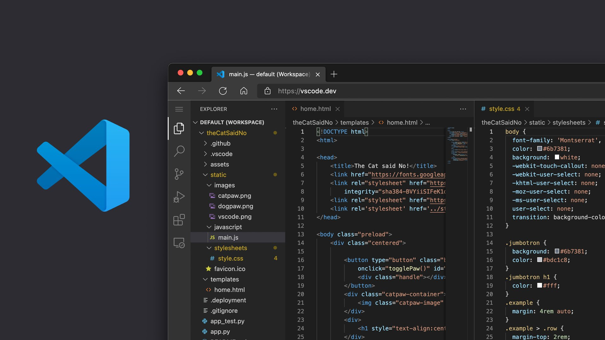

<link rel="stylesheet" href="./assets/css/style.css">

# Hi, I'm Spartan (💻💖)




# 😅 This is my VSCode Setup

This is a setup that I worked hard on trying to find the one that I liked the most

## 📄 Font Used

- [JetBrains Mono](https://www.jetbrains.com/lp/mono/)

## 📥 Extensions List

- [Better Comments]()
- [Codesnap]()
- [Bootstrap5 Vscode]()
- [Vscode Mjml]()
- [Blackbox]()
- [Path Intellisense]()
- [Vscode Clock]()
- [Vscode Eslint]()
- [Intelli Php Vscode]()
- [Phptools Vscode]()
- [Profiler Php Vscode]()
- [Svg Viewer]()
- [Gitlens]()
- [Vsc Material Theme]()
- [Vsc Material Theme Icons]()
- [Prettier Vscode]()
- [Auto Rename Tag]()
- [Code Runner]()
- [Remotehub]()
- [Vscode Status Bar Title]()
- [Readme Preview]()
- [Debugpy]()
- [Python]()
- [Remote Ssh]()
- [Remote Ssh Edit]()
- [Remote Wsl]()
- [Azure Repos]()
- [Remote Explorer]()
- [Remote Repositories]()
- [Vsliveshare]()
- [Material Icon Theme]()
- [Vscode Css Peek]()
- [Liveserver]()
- [Vscode Pets]()
- [Errorlens]()
- [Discord Py Snippets]()
- [Wordpress Toolbox]()
- [Vscode Js]()

## 🔧 Settings JSON

```sh
{
  "workbench.startupEditor": "none",
  "security.workspace.trust.untrustedFiles": "open",
  "editor.minimap.enabled": false,
  "workbench.iconTheme": "material-icon-theme",
  "explorer.confirmDelete": false,
  "editor.formatOnSave": true,
  "liveServer.settings.donotShowInfoMsg": true,
  "git.enableSmartCommit": true,
  "git.confirmSync": false,
  "editor.fontFamily": "JetBrains Mono",
  "editor.fontWeight": "bold",
  "editor.fontLigatures": true,
  "editor.bracketPairColorization.enabled": true,
  "editor.smoothScrolling": true,
  "editor.mouseWheelZoom": true,
  "editor.defaultFormatter": "esbenp.prettier-vscode",
  "notebook.defaultFormatter": "esbenp.prettier-vscode",
  "better-comments.tags": [
    {
      "tag": "TODO:",
      "color": "#EA580C",
      "strikethrough": false,
      "backgroundColor": "transparent"
    },
    {
      "tag": "FIXME:",
      "color": "#FF2D00",
      "strikethrough": false,
      "backgroundColor": "transparent"
    },
    {
      "tag": "BUG:",
      "color": "#9333EA",
      "strikethrough": false,
      "backgroundColor": "transparent"
    },
    {
      "tag": "HACK:",
      "color": "#C026D3",
      "strikethrough": false,
      "backgroundColor": "transparent"
    },
    {
      "tag": "NOTE:",
      "color": "#2563EB",
      "strikethrough": false,
      "backgroundColor": "transparent"
    },
    {
      "tag": "INFO:",
      "color": "#0EA5E9",
      "strikethrough": false,
      "backgroundColor": "transparent"
    },
    {
      "tag": "IDEA:",
      "color": "#FFF",
      "strikethrough": false,
      "backgroundColor": "#EAB308"
    }
  ],
  "workbench.colorTheme": "Material Theme Ocean High Contrast",
  "remote.SSH.remotePlatform": {
    "spartan-craft.sytes.net": "linux"
  },
  "editor.stickyScroll.enabled": false,
  "liveServer.settings.ignoreFiles": [
    ".vscode/**",
    "**/*.scss",
    "**/*.sass",
    "**/*.ts"
  ]
}
```

<br>

💻💖 by [xSpartan155x](https://github.com/xSpartan155x)
